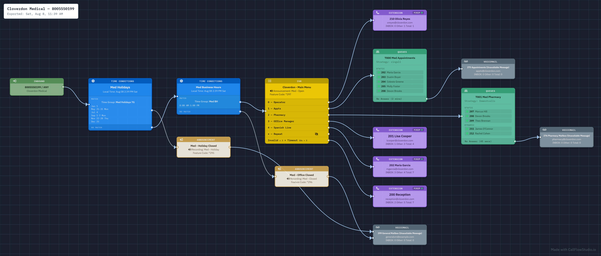

# Call Flow Studio

### See every route. On FreePBX, build it forward.

A visual dial-plan **editor for FreePBX** and a first-class **read-only visualizer for VitalPBX** — served from your own PBX at `/cfstudio/`.

[**Website**](https://callflowstudio.io) · [**Demo**](https://callflowstudio.io/demo) · [**Screenshots**](https://callflowstudio.io/screenshots) · [**Pricing**](https://callflowstudio.io/pricing) · [**Releases**](https://callflowstudio.io/releases) · <support@callflowstudio.io>

---

Phone-system admins read their dial plan backward — clicking destination by destination, holding the call path in their head. Call Flow Studio renders the whole thing as a diagram you can actually follow. And on FreePBX it lets you **build it forward**: drop a node, wire it up, and the route exists before the first call ever hits it.

<!-- Representative per-DID view — a single inbound number's call flow, not a wall of every route at once. -->

## On every platform

- **Every route, rendered.** Inbound routes, time conditions, IVRs, ring groups, queues, announcements — the real path your calls take, laid out as a graph you can actually follow.
- **Live status, on every node.** Extension nodes paint a registration dot in real time: green for registered, red for offline, amber for DND, purple for call forward. Queue and ring-group rows show the same per member, pulled from the Asterisk Manager Interface on every graph load.
- **Time travel.** Simulate any date and time. The graph dims the paths that wouldn't fire and highlights the one that would, so "what happens during the company event next Tuesday afternoon?" is a question you answer by picking a time instead of tracing it by hand.
- **Hide any branch.** Big call flows get unreadable. Collapse everything downstream of a node and the diagram shrinks to the path you care about. A hidden branch is remembered by what it points at, so it stays hidden in every flow that reaches it. Nothing is deleted, and you can reveal it any time.
- **Sticky notes and edge annotations.** Paste context directly on the canvas: checklists, URLs, inline comments on edges. Every note records who wrote it and when.
- **Export for humans.** PNG with a destination and timestamp stamp, at full quality or sanitized with PII blacked out, for diagrams that travel beyond the PBX owner.
- **Give access without giving the keys.** Call Flow Studio runs its own user system, separate from your PBX admin auth. Three roles: admins manage everything, technicians change dial plans, and read-only users can pan, zoom, search, and reload but never edit. No user of any role can touch SIP trunks, system settings, or delete extensions.
- **In-Use-By reverse walk.** Pick any destination, a time condition, an IVR, a queue, and Call Flow Studio walks every module's destination columns backwards to show everything that points at it. Phantom references stop being phantoms.
- **Speaks your language.** The interface is fully localized in 12 languages, picked at install or per user.

## On FreePBX, you can also edit

This is where Call Flow Studio stops being a diagram and starts being the tool you build in.

- **The first forward-building dial-plan editor for the FreePBX family.** Drop the inbound, drop the next node, wire it, save. No more starting at the queue and walking backward through dropdowns to make destinations exist before the routes that point at them.
- **Undo.** Something a PBX admin UI doesn't give you, and Call Flow Studio does.
- **Jump straight to the config.** Click a node and open it in FreePBX at the exact edit screen for that IVR, queue, ring group, or extension, with no hunting through the admin menus.
- **Flip Call Flow Controls from the graph.** Toggle day and night mode on the canvas instead of hunting for a feature code. No more "who switched the phones?"
- **Every edit goes through FreePBX itself.** Changes are written with FreePBX's own module functions and the standard *Apply Config*, the same path the admin GUI uses, so the astdb keys, dependent tables, and reload flags all happen exactly as they should.

## On VitalPBX

Read-only, by design. Call Flow Studio renders VitalPBX 3 and 4 flows with the same graph, live status, and search as above, scoped correctly per tenant, and never writes anything back. Cross-tenant search reaches every tenant at once and each login sees only the tenants it should.

## Safe by design

Call Flow Studio runs entirely on your own PBX, served from `/cfstudio/` on the box itself. There is no cloud component, no external service rendering your call flows, and nothing about your dial plan ever leaves the machine. It never makes raw, out-of-band database writes on any platform.

## Supported platforms

| Platform | Versions | Capability |
|---|---|---|
| **FreePBX** | 14, 15, 16, 17 (and FreePBX-based distributions) | Visualize + edit |
| **VitalPBX** | 3 and 4 | Visualize (read-only) |

Auto-detected at install — one package covers all of the above.

**You don't need a deployment ID.** Call Flow Studio is not a FreePBX module and is not distributed through the FreePBX module store, so none of the commercial-module machinery applies. It installs alongside your PBX at `/cfstudio/` and identifies FreePBX by its configuration file, not by registration status. No deployment ID, no Sangoma account, no portal entitlement. A self-built FreePBX, a distribution rebuild, an unregistered box, or an older install that predates all of it works exactly the same. Nothing appears in Module Admin, and FreePBX module updates leave it untouched.

## Pricing

On the **FreePBX family**, the complete read-only visualizer is **free for good**. No credit card, no expiry. Editing is the optional part, and you get it for your first 30 days.

On **VitalPBX**, Call Flow Studio is read-only for everyone, so the free tier covers your first two tenants and a license opens the rest.

Editing on the FreePBX family and every tenant on VitalPBX come from the same one-time **per-PBX license**, same price on both platforms. Current pricing is on the [website](https://callflowstudio.io/pricing). There is no paywall and no locked-out screen: if a license lapses, the install settles back onto the free tier and nothing you have built is deleted.

→ [**Get Call Flow Studio**](https://callflowstudio.io)

## Documentation & support

- **Install, licensing, and usage docs:** [callflowstudio.io](https://callflowstudio.io)
- **Release notes:** [callflowstudio.io/releases](https://callflowstudio.io/releases)
- **Support:** <support@callflowstudio.io>

---

Call Flow Studio is a commercial product. This repository hosts project information only — the application is distributed exclusively via [callflowstudio.io](https://callflowstudio.io).

© Call Flow Studio. All rights reserved.

