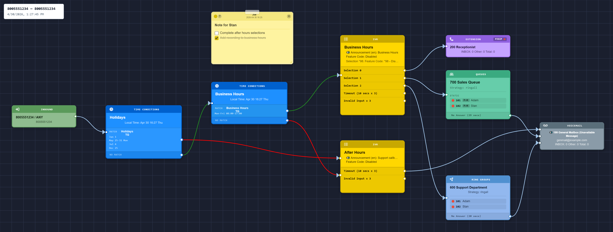

# Call Flow Studio

### See every route. On FreePBX, build it forward.

A visual dial-plan **editor for FreePBX** and a first-class **read-only visualizer for VitalPBX** — served from your own PBX at `/cfstudio/`.

[**Website**](https://callflowstudio.io) · [**Demo**](https://callflowstudio.io/demo) · [**Screenshots**](https://callflowstudio.io/screenshots) · [**Pricing**](https://callflowstudio.io/pricing) · [**Releases**](https://callflowstudio.io/releases) · <support@callflowstudio.io>

---

Phone-system admins read their dial plan backward — clicking destination by destination, holding the call path in their head. Call Flow Studio renders the whole thing as a diagram you can actually follow. And on FreePBX it lets you **build it forward**: drop a node, wire it up, and the route exists before the first call ever hits it.

<!-- Representative per-DID view — a single inbound number's call flow, not a wall of every route at once. -->

## On every platform

- **Every route, rendered.** Inbound routes, time conditions, IVRs, ring groups, queues, announcements — the real path your calls take, laid out as a graph you can actually follow.
- **Live status, on every node.** Real-time registration and call state shown right on the diagram — including after an *Apply Config*.
- **Give access without giving the keys.** Role-based access (admin / technician / read-only) lets you hand a flow to a new tech, or to a client, without handing over the whole PBX.
- **Speaks your language.** The interface is fully localized across 11 languages.
- **Multi-tenant aware.** On VitalPBX, flows and live status are correctly scoped per tenant.

## On FreePBX, you can also edit

- **The first forward-building dial-plan editor.** Design a flow on the canvas and apply it, instead of reverse-engineering destination dropdowns one screen at a time.
- **Undo.** Something a PBX admin UI doesn't give you, and Call Flow Studio does.

## Safe by design

On **VitalPBX**, Call Flow Studio is strictly **read-only** — it reads the same configuration your PBX reads and never writes anything back. On **FreePBX**, when you make a change it writes through **FreePBX's own APIs and the standard *Apply Config*** — the exact path the native GUI uses — never raw, out-of-band database writes. Either way it runs entirely on your own PBX; nothing about your dial plan leaves the box.

## Supported platforms

| Platform | Versions | Capability |
|---|---|---|
| **FreePBX** | 14, 15, 16, 17 (and FreePBX-based distributions) | Visualize + edit |
| **VitalPBX** | 3 and 4 | Visualize (read-only) |

Auto-detected at install — one package covers all of the above.

## Pricing

A **30-day free trial, no card required.** After that, a simple one-time **per-PBX license** — current pricing is on the [website](https://callflowstudio.io/pricing). If the trial lapses, the **free floor remains** (FreePBX: Visualize only, VitalPBX: up to 2 tenants).

→ [**Start a trial / get a license**](https://callflowstudio.io)

## Documentation & support

- **Install, licensing, and usage docs:** [callflowstudio.io](https://callflowstudio.io)
- **Release notes:** [callflowstudio.io/releases](https://callflowstudio.io/releases)
- **Support:** <support@callflowstudio.io>

---

Call Flow Studio is a commercial product. This repository hosts project information only — the application is distributed exclusively via [callflowstudio.io](https://callflowstudio.io).

© Call Flow Studio. All rights reserved.

